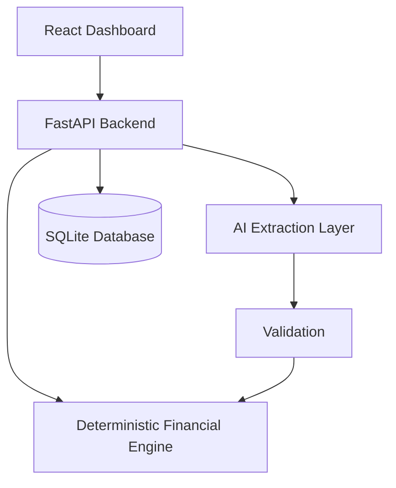

# Buy or Wait?

An AI-assisted financial decision-support application that answers: **"Can I safely afford this purchase?"**

> **Disclaimer**: This project is a portfolio evolution of a HackerRank "Buy or Wait?" challenge solution. It is a clean-room reimplementation based on the documented challenge requirements and rules. It is not the original competition implementation. This is not production financial advice.

## Problem Statement
Users need help deciding if they can afford large purchases. Current banking apps just show the balance. This system calculates affordability by simulating 90 days of cash flow, enforcing minimum balance constraints, and generating safe payment plans.

## Key Features
- **Deterministic Financial Engine**: Computes affordability via 90-day cash-flow simulation, strictly maintaining minimum balances. Evaluates full payment, partial payment, wait, and installment plans.
- **AI Extraction Layer**: Extensible interfaces (`DocumentExtractor` and `MessageExtractor`) to safely parse unstructured user inputs (invoices and messages) into structured financial records.
- **Fintech Dashboard**: A responsive, multi-page React application presenting financial health, charts, and recommendations.

## Architecture



- **Frontend**: React, TypeScript, Vite, Tailwind CSS, Recharts.
- **Backend**: Python, FastAPI, Pydantic, SQLAlchemy.
- **Database**: SQLite (local development).

## How to Run Locally

### Environment Setup
Create a `.env` file in the `backend/` directory:
```
# .env
CORS_ORIGINS=["http://localhost:5173", "http://127.0.0.1:5173"]
```

### Backend
1. `cd backend`
2. `python -m venv venv`
3. `venv\Scripts\activate` (Windows)
4. `pip install -r requirements.txt`
5. `python seed.py`
6. `uvicorn main:app --reload --port 8000`

### Frontend
1. `cd frontend`
2. `npm install`
3. `npm run dev`

### Tests
In the `backend` directory, run:
`pytest tests/`

## API Overview
- `GET /api/v1/health`
- `GET /api/v1/profile`
- `GET /api/v1/events`
- `POST /api/v1/analyze`

## Current Capabilities
- **Deterministic Financial Engine**: Computes affordability via 90-day cash-flow simulation, strictly maintaining minimum balances. Evaluates full payment, partial payment, wait, and installment plans.
- **AI Information Extraction**: Extensible interfaces (`RealLLMDocumentExtractor` and `RealLLMMessageExtractor`) safely parse unstructured user inputs (invoices and messages) into structured financial records. Supports fallback to `MockDocumentExtractor` and `MockMessageExtractor` for local development without an API key. 
- **Validation Pipeline**: Deterministic validation runs *after* AI extraction to ensure no hallucinations (e.g. negative amounts) slip into the financial state. Human review is mandatory.
- **End-to-End Persisted Workflows**: Document approvals trigger real purchase simulations. Message approvals safely create normalized financial events and instantly recalculate the 90-day forecast.
- **Fintech Dashboard**: A responsive, multi-page React application presenting financial health, charts, and AI review workflows using Tailwind CSS.
- **API and Database**: FastAPI backend powered by SQLite, fully tracking profiles, events, extractions, and analysis results.

## Configuration & Local Setup
To run the Real AI extraction using OpenAI's GPT-4o, add your key to a `.env` file in the root:
```env
OPENAI_API_KEY=your-actual-api-key
```
If no key is present (or `your_key_here`), the app gracefully falls back to a Mock Extractor.

## Security & AI Limitations
- **Information Component Only**: AI extraction is used *only* to convert unstructured information into structured financial facts. The deterministic engine remains the sole source of truth for affordability decisions.
- **Human Review**: AI output is never blindly applied. The frontend requires explicit human review and approval for all parsed events.
- **Untrusted Input**: All uploaded images and text are treated as untrusted. The AI is explicitly prompted to ignore embedded instructions.

## Current Limitations
- **AI Services**: Currently uses mocked extraction logic. Real LLM/VLM providers are not yet integrated into the endpoints.
- **Forecast Optimization**: The 90-day simulation algorithm is linear and operates strictly in memory, which is perfect for an individual user's forecast but might need optimization if calculating thousands of events simultaneously.
- **Authentication**: Auth is mocked for demo purposes.

## Planned Improvements
- Integration with an actual VLM (e.g. GPT-4o or Claude 3.5 Sonnet) for parsing invoice uploads.
- Full authentication and multi-tenant Postgres support.
- Configurable notification alerts for when cash flow drops below minimum reserves.
