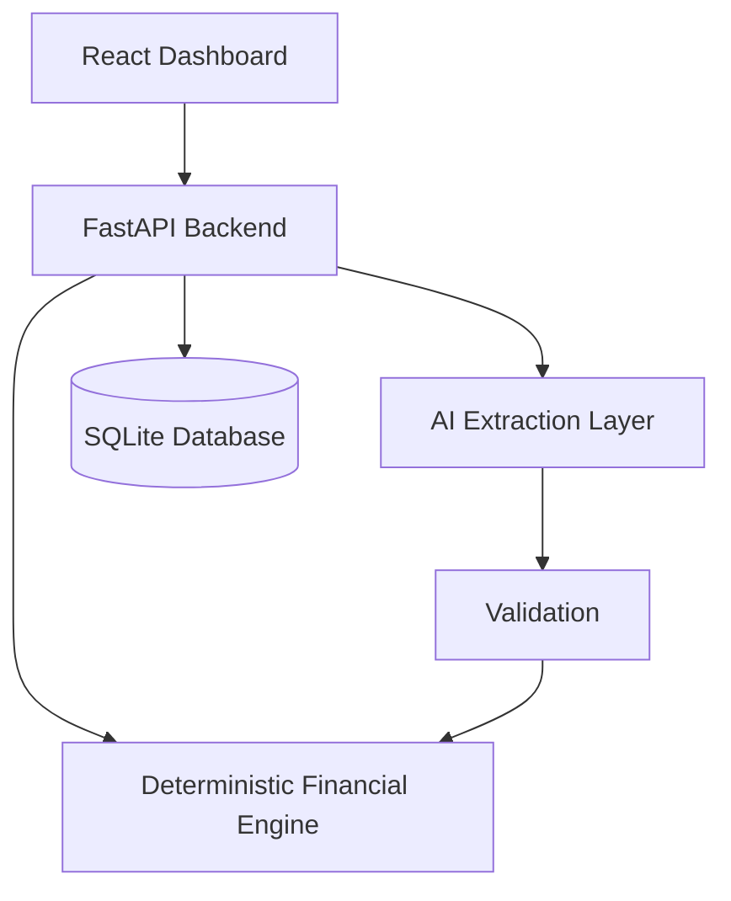

# Buy or Wait?

An AI-assisted financial decision-support application that answers: **"Can I safely afford this purchase?"**

> **Disclaimer**: This project is a portfolio evolution of a HackerRank "Buy or Wait?" challenge solution. It is a clean-room reimplementation based on the documented challenge requirements and rules. It is not the original competition implementation. This is not production financial advice.

## Problem Statement
Users need help deciding if they can afford large purchases. Current banking apps just show the balance. This system calculates affordability by simulating 90 days of cash flow, enforcing minimum balance constraints, and generating safe payment plans.

## Key Features
- **Deterministic Financial Engine**: Computes affordability via 90-day cash-flow simulation, strictly maintaining minimum balances. Evaluates full payment, partial payment, wait, and installment plans.
- **AI Extraction Layer**: Extensible interfaces (`DocumentExtractor` and `MessageExtractor`) to safely parse unstructured user inputs (invoices and messages) into structured financial records.
- **Fintech Dashboard**: A responsive, multi-page React application presenting financial health, charts, and recommendations.

## Architecture



- **Frontend**: React, TypeScript, Vite, Tailwind CSS, Recharts.
- **Backend**: Python, FastAPI, Pydantic, SQLAlchemy.
- **Database**: SQLite (local development).

## How to Run Locally

### Environment Setup
Create a `.env` file in the `backend/` directory:
```
# .env
CORS_ORIGINS=["http://localhost:5173", "http://127.0.0.1:5173"]
```

### Backend
1. `cd backend`
2. `python -m venv venv`
3. `venv\Scripts\activate` (Windows)
4. `pip install -r requirements.txt`
5. `python seed.py`
6. `uvicorn main:app --reload --port 8000`

### Frontend
1. `cd frontend`
2. `npm install`
3. `npm run dev`

### Tests
In the `backend` directory, run:
`pytest tests/`

## API Overview
- `GET /api/v1/health`
- `GET /api/v1/profile`
- `GET /api/v1/events`
- `POST /api/v1/analyze`

## Current Capabilities
- **Deterministic Financial Engine**: Computes affordability via 90-day cash-flow simulation, strictly maintaining minimum balances. Evaluates full payment, partial payment, wait, and installment plans.
- **AI Extraction Layer**: Extensible interfaces (`DocumentExtractor` and `MessageExtractor`) to safely parse unstructured user inputs (invoices and messages) into structured financial records. Currently uses `MockDocumentExtractor` and `MockMessageExtractor` for robust local development.
- **Fintech Dashboard**: A responsive, multi-page React application presenting financial health, charts, and recommendations using Tailwind CSS.
- **API and Database**: FastAPI backend powered by SQLite, pre-configured with a seed database to run immediately.

## Current Limitations
- **AI Services**: Currently uses mocked extraction logic. Real LLM/VLM providers are not yet integrated into the endpoints.
- **Forecast Optimization**: The 90-day simulation algorithm is linear and operates strictly in memory, which is perfect for an individual user's forecast but might need optimization if calculating thousands of events simultaneously.
- **Authentication**: Auth is mocked for demo purposes.

## Planned Improvements
- Integration with an actual VLM (e.g. GPT-4o or Claude 3.5 Sonnet) for parsing invoice uploads.
- Full authentication and multi-tenant Postgres support.
- Configurable notification alerts for when cash flow drops below minimum reserves.
