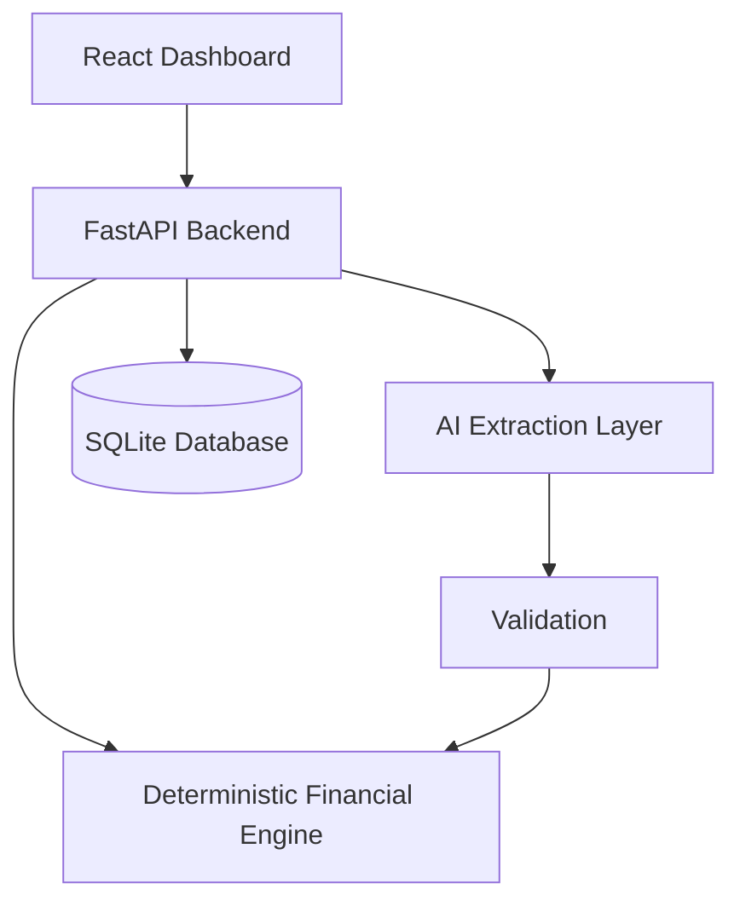

# Buy or Wait?

An AI-assisted financial decision-support application that answers: **"Can I safely afford this purchase?"**

> **Disclaimer**: This project is a portfolio evolution of a HackerRank "Buy or Wait?" challenge solution. It is a clean-room reimplementation based on the documented challenge requirements and rules. It is not the original competition implementation. This is not production financial advice.

## Problem Statement
Users need help deciding if they can afford large purchases. Current banking apps just show the balance. This system calculates affordability by simulating 90 days of cash flow, enforcing minimum balance constraints, and generating safe payment plans.

## Key Features
- **Deterministic Financial Engine**: Computes affordability via 90-day cash-flow simulation, strictly maintaining minimum balances. Evaluates full payment, partial payment, wait, and installment plans.
- **AI Extraction Layer**: Extensible interfaces (`DocumentExtractor` and `MessageExtractor`) to safely parse unstructured user inputs (invoices and messages) into structured financial records.
- **Fintech Dashboard**: A responsive, multi-page React application presenting financial health, charts, and recommendations.

## Architecture


```mermaid
graph TD
    UI[React Dashboard] --> API[FastAPI Backend]
    API --> Ext[AI Extraction Layer]
    API --> DB[(SQLite Database)]
    API --> FE[Deterministic Financial Engine]
    Ext --> Val[Validation]
    Val --> FE
```

- **Frontend**: React, TypeScript, Vite, Tailwind CSS, Recharts.
- **Backend**: Python, FastAPI, Pydantic, SQLAlchemy.
- **Database**: SQLite (local development).

## Environment Variables
Create a `.env` file in the `backend/` directory by copying `.env.example`:
```env
DATABASE_URL=sqlite:///./buy_or_wait.db
JWT_SECRET_KEY=your_secure_random_string_here
JWT_ALGORITHM=HS256
JWT_ACCESS_TOKEN_EXPIRE_MINUTES=1440
CORS_ORIGINS=http://localhost:5173
OPENAI_API_KEY=your_openai_api_key_here
MAX_UPLOAD_SIZE_MB=5
```

Create a `.env` file in the `frontend/` directory by copying `.env.example`:
```env
VITE_API_BASE_URL=http://localhost:8000/api/v1
```

## Security
- **Authentication**: JWT-based authentication via bcrypt hashed passwords.
- **Secrets Management**: Secrets are required to be supplied via deployment configuration. `.env` is ignored by Git, and AI API keys stay strictly server-side.
- **Document Uploads**: 5MB size limits, exact MIME/extension validation, and safe filename sanitization to prevent path traversal.
- **CORS**: Strictly defined by `CORS_ORIGINS`.

## Database Migrations
Migrations are handled via Alembic. To update your database to the latest schema:
```bash
alembic upgrade head
```

## Development Setup

### Backend
1. `cd backend`
2. `python -m venv venv`
3. `venv\Scripts\activate` (Windows)
4. `pip install -r requirements.txt`
5. `alembic upgrade head`
6. `uvicorn main:app --reload --port 8000`

### Frontend
1. `cd frontend`
2. `npm install`
3. `npm run dev`

### Tests
In the `backend` directory, run:
`pytest tests/`

## Production Configuration
- Ensure a strong `JWT_SECRET_KEY` is generated and injected.
- `DATABASE_URL` should point to a secure production database (e.g. Postgres).
- Ensure `.env` files are local-only; in deployment platforms like Vercel or Railway, inject environment variables directly into the dashboard.

## Security & AI Limitations
- **Information Component Only**: AI extraction is used *only* to convert unstructured information into structured financial facts. The deterministic engine remains the sole source of truth for affordability decisions.
- **Human Review**: AI output is never blindly applied. The frontend requires explicit human review and approval for all parsed events.
- **Untrusted Input**: All uploaded images and text are treated as untrusted. The AI is explicitly prompted to ignore embedded instructions.

## Planned Improvements
- Integration with an actual VLM (e.g. GPT-4o or Claude 3.5 Sonnet) for parsing invoice uploads.
- Configurable notification alerts for when cash flow drops below minimum reserves.
